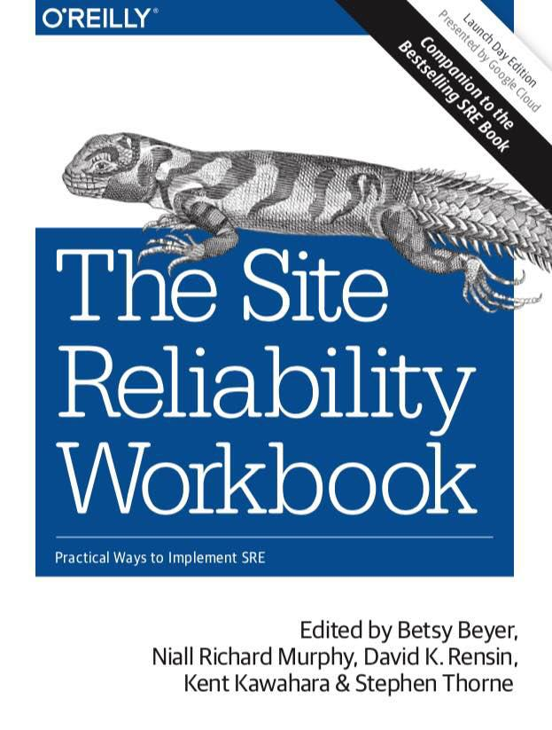

# This repository contains resourses dedicated to Cybersecurity & Machine Learning primarly.

## BOOKS
</n>

#### 1. Machine Learning and Security: Protecting Systems with Data and Algorithms
How ML&DL methods can solve cybersecurity problems

#### 2. The Site Reliability Workbook 
Interesting architecture solutions

#### 3. Python Forensics

#### 4. BEAM - a book about Erlang' concurrency model, showing the concept of 
#### asynchronous messages, different from the one choosen by Guido for Python 

## ARTICLES

#### 1. How Shall We Play a Game?: A Game-theoretical Model for Cyber-warfare Games
Application of game theory toward the augmentation of the human decision-making process

#### 2. Моделирование информационного противоборства в социальных сетях на основе теории игр и динамических байесовских сетей

#### 3. Нейросетевой подход к задаче иерархического представления компьютерной сети

#### 4. Game Theory & ML for self-adapted Honeypots (dissertation)

## SLIDES

#### 1. RoVe: устойчивые к шуму устойчивые вектора слов (spBDSM 2018)
Валентин Малых из Лаборатории глубокого обучения и нейронных сетей МФТИ 

реализовал алгоритм на Keras без C++ и  параллельности:

https://gitlab.com/madrugado/robust-w2v

Но код академический, нужны рефакторинг, API, документация

#### 2. A Hacker's Guide to securing Python Web Applications (from Moscow Python Conf++ 2018)

#### 3. Антиспуфинг в биометрических системах (spBDSM 2018)

## LINKS

#### 1. ICC 2018
* translations: https://icc.moscow/translyatsii.html

* program: https://icc.moscow/Full-Program-with-speakers-5-6-July.Ru.pdf

#### 2. Arcticles from conferences on NLP: 
* http://nlp.rusvectores.org/ru/
